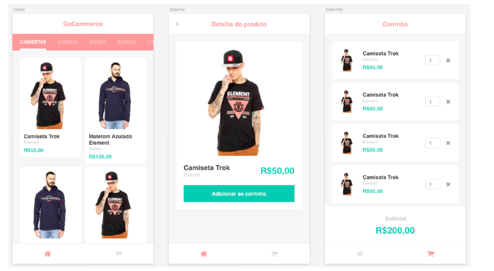

# Aplicativo de catálogo de produtos

Este foi o desafio do módulo 4 do curso de React Native do BootCamp da [RocketSeat](http://www.rocketseat.com.br)

Nesse desafio foi construida uma aplicação com interface de e-commerce, o usuário poderá
adicionar produtos ao carrinho e no final exibir o valor total do pedido.

Além disso, os dados de produtos e categorias virão de uma API com json-server (o arquivo da
API está na raiz do projeto).

A interface da aplicação será como a seguinte:

Recursos que foram utilizados:

- React Navigation
- Axios
- ReactoTron
- Redux
- Saga
- Jest

## Instalação

- git clone https://github.com/dbins/rocketseat-reactnative-desafio4
- npm install
- Ative o backend executando o comando json-server api.json -H 192.168.9.1 -p 3001 -w -d 500. Onde está 192.168.9.1, coloque o IP de sua máquina. Não pode utilizar 127.0.0.1 porque ele não pode ser acessado pelo emulador.
- Edite o arquivo /src/services/api com o endereço da API
- Abra o emulador. Os testes foram feitos utilizando o emulador Genymotion (Android)
- react-native run-android

## Regras

- Os dados devem ser consumidos do JSON Server utilizando o arquivo server.json em
  anexo;
- O usuário deve poder adicionar produtos, alterar sua quantidade e removê-lo do carrinho;
- O valor do carrinho deve ser calculado pela soma dos preços x quantidades;
- A barra de categorias deve fornecer scroll horizontal para ver todas categorias;
- As requisições assíncronas devem utilizar Redux Saga;
- Você deve exibir sinais de loading enquanto a requisição está sendo feita na lista de produtos/categorias inicial;

## URL's

- http://localhost:3000/categories (Busca categorias)
- http://localhost:3000/category_products/1 (Busca produtos pelo ID da categoria)
- http://localhost:3000/products/1 (Busca detalhes do produto pelo ID)

## Teste unitários

Existem vários testes automatizados do aplicativo. Para executar os testes, a partir da raiz do projeto, basta digitar JEST. Os testes são referentes aos componentes, reducers e sagas.
